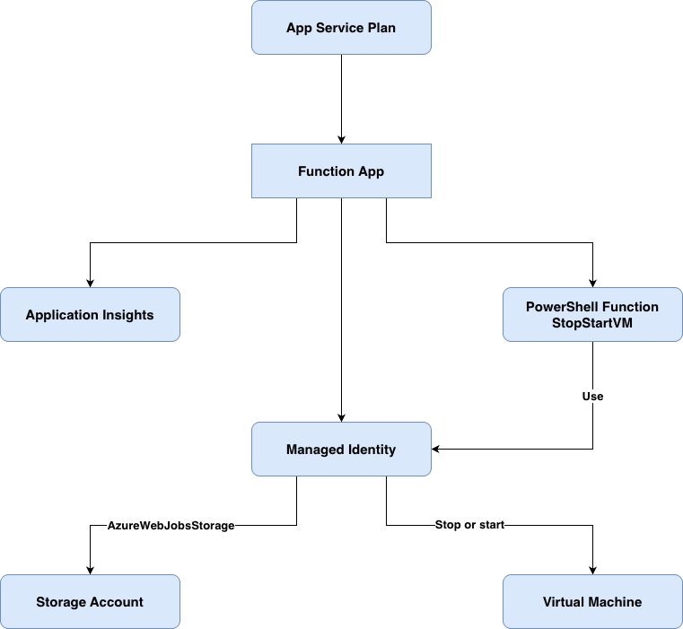

## Description
Dans le cadre d'une démarche FinOPS, cette Azure function permet de gérer l'arrêt et le démarrage automatique des Machines virtuelle pour lesquelles certains tags ont étés spécifiés et sur des plages horaires définies par ces tags.

## Architecture fonctionnel

## Découpage
- Le présent projet infra-stopstart-vm contient l'infrastructure as code
- Le projet app-stopstart-vm contient le code de l'application StopStartVm

## Utilisation
La solution s'appuie sur une fonction StopStartVm (script [run.ps1](https://github.com/serignemodou/azure-finOps/blob/main/stopstart-vm/app-stopstart-vm/StopStartVM/run.ps1) link) qui s'éxecute [toutes les heures](https://github.com/serignemodou/azure-finOps/blob/main/stopstart-vm/app-stopstart-vm/StopStartVM/function.json#L7) et nous permet d'arreter ou de relancer les machine virtuelle en fonction de leurs tags.

Afin qu'une Machine virtuelle puisse être prise en charge par la fonction StopStartVm, les tags suivants doivent être ajoutés:

- Le tag 'Operational-Schedule' (Obligatoire) qui permet d'activer la prise en charge d'un arrêt/démarrage automatique par l'Azure Function.
```
Operational-Schedule: Yes
```
- L'un des tags 'Operational-Weekdays' ou 'Operational-Weekends' (Obligatoire) qui permettent de définir la plage horaire d'arrêt en ou hors week-end
```
Operational-Weekdays: 7-19
Operational-Weekends: 7-19
```

NB: Si le tag Operational-Weekends n'est pas spécifié, la machine virtuelle ne sera pas gérée le week-end. Le dernier état connu du vendredi sera son état durant tout le week-end.

- Le tag 'Operational-Exclusions' (Optionnel) permet de gérer les exceptions en ignorant certains jours spécifiques (Par exemple: jours fériés, date spécifiques, week-end) ou en ignorant une action (telle que stop)
```
Operational-Exclusions: [Sunday][Jan 01][Weekends][Stop][Start]
```
- Le tag 'Operational-UTCOffset' (Optionnel) permet de gérer plusieurs fuseaux horaires
```
Operational-UTCOffset: -8
```